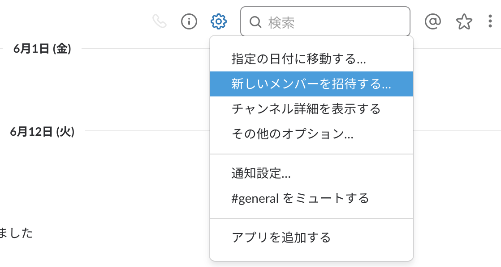

# SlackJava

## 事前準備

pom.xml で simple slack api を追加。

```
<dependencies>
    <dependency>
        <groupId>com.ullink.slack</groupId>
        <artifactId>simpleslackapi</artifactId>
        <version>1.2.0</version>
    </dependency>
</dependencies>
```

Slack Workspace でアプリ追加後メンバーとして招待。


